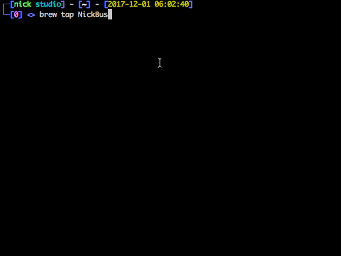

# BulletNotesCli

A quick, easy interface to manage your notes using the BulletNotesBot.

Usage:

```
brew tap NickBusey/BulletNotesCli
brew install bulletnotescli
bulletnotescli
```

Follow the directions to add your API key, then type `/help` to view available commands!

<p align="center">
    
</p>
